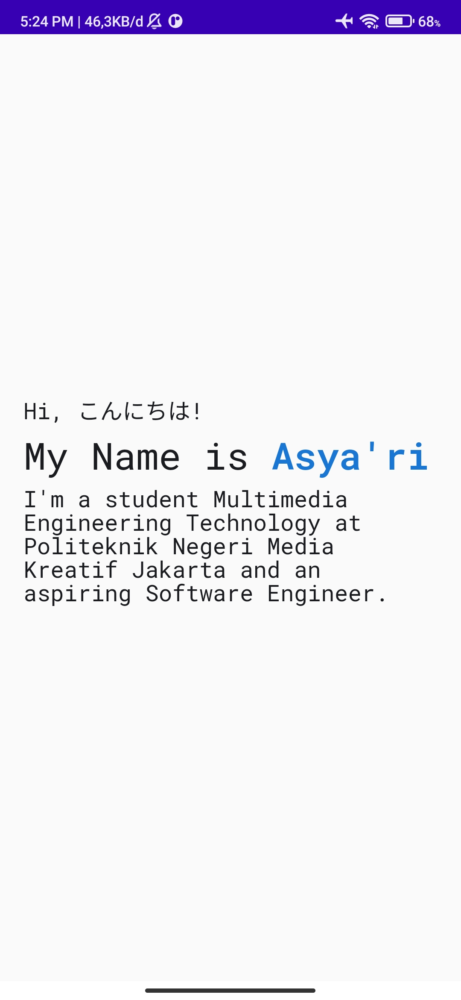
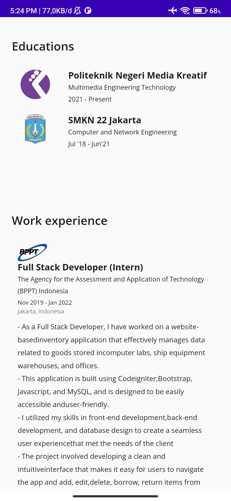
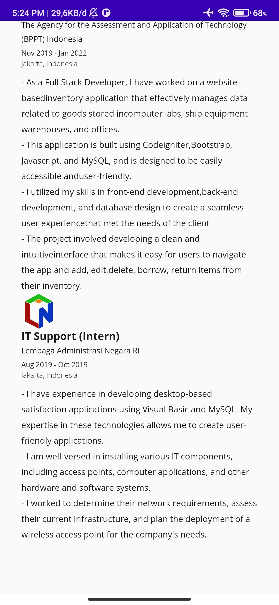
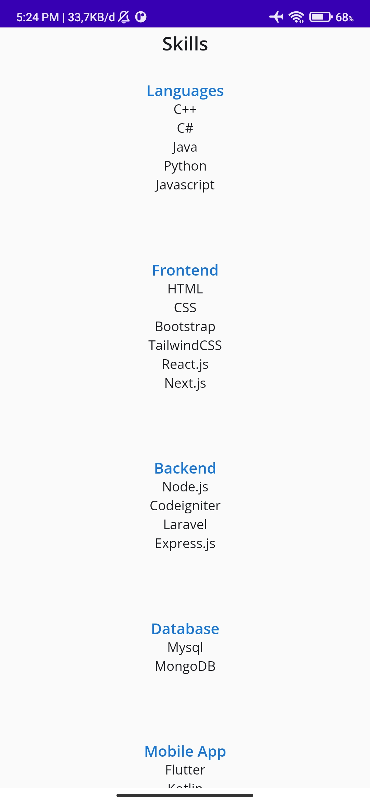
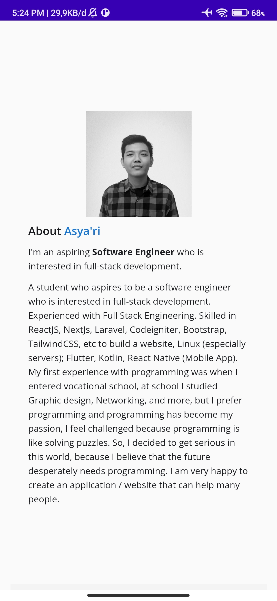
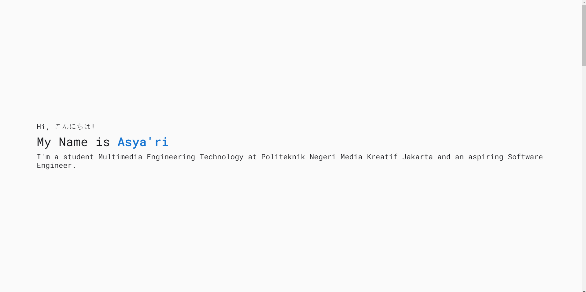
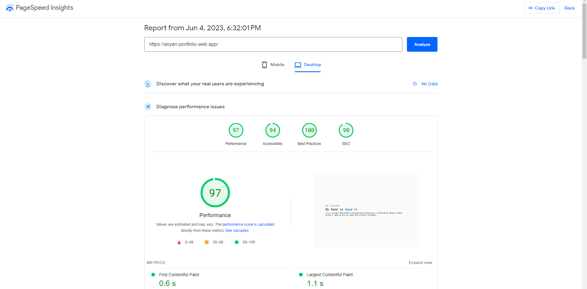

# UAS Pemprograman Visual Individu
Nama : Asya'ri
NIM : 21240018
Kelas : TRM4A

## Preview Mobile

 
Download .apk : [Download](apk/app-debug.apk)
 
## Preview Website

Link Website : https://asyari-portfolio.web.app atau https://asyaris-site.webflow.io
 
## Optimalisasi website

Langkah-langkah yang dilakukan untuk meningkatkan nilai kualitas website dari lighthouse :
1. Serve images in next-gen formats
2. Reduce unused JavaScript
3. Eliminate render-blocking resources
4. Minify Javascript
